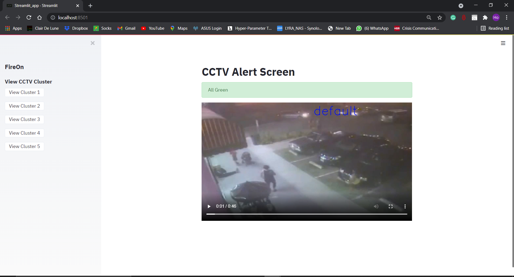
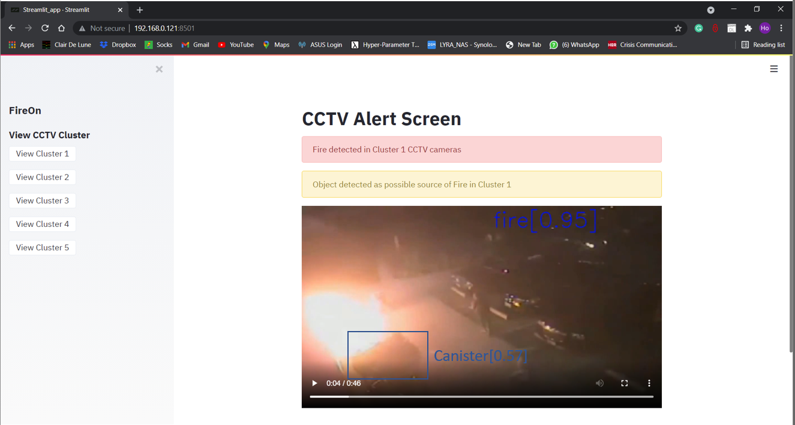

# SCDF_Innovation_Challenge
The following outlines team RE(Solutons)'s solution: FireOn functionalities
## Description
FireOn is a machine learning model web application that detects fires and objects that could be associated with antecedents of fire. The application is built using Tensorflow and Streamlit. The model is builded using a ResNet50 model architecture. 
## App Screenshots

## References
CASE STUDY On Fire Detection System using Computer Vision and Image Processing Technique
(https://www.researchgate.net/publication/334172126_CASE_STUDY_On_Fire_Detection_System_using_Computer_Vision_and_Image_Processing_Technique)

Early Fire detection system using deep learning and OpenCV
(https://towardsdatascience.com/early-fire-detection-system-using-deep-learning-and-opencv-6cb60260d54a)

Understanding and Coding a ResNet in Keras
(https://towardsdatascience.com/understanding-and-coding-a-resnet-in-keras-446d7ff84d33)
## Acknowledgements

